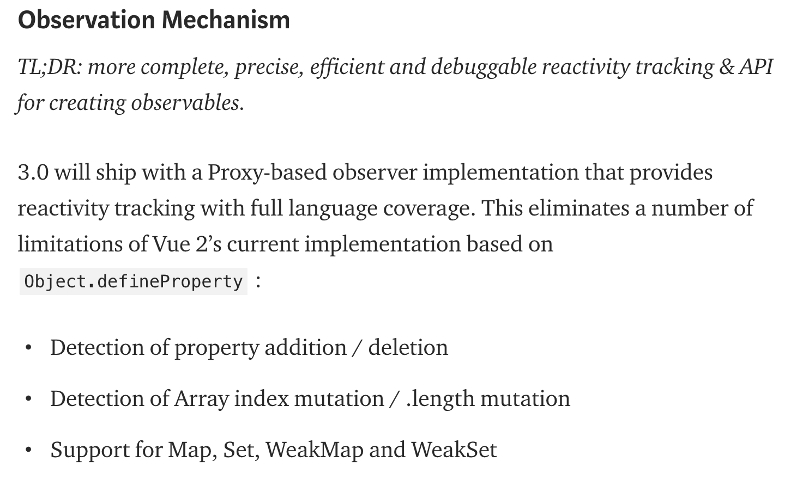
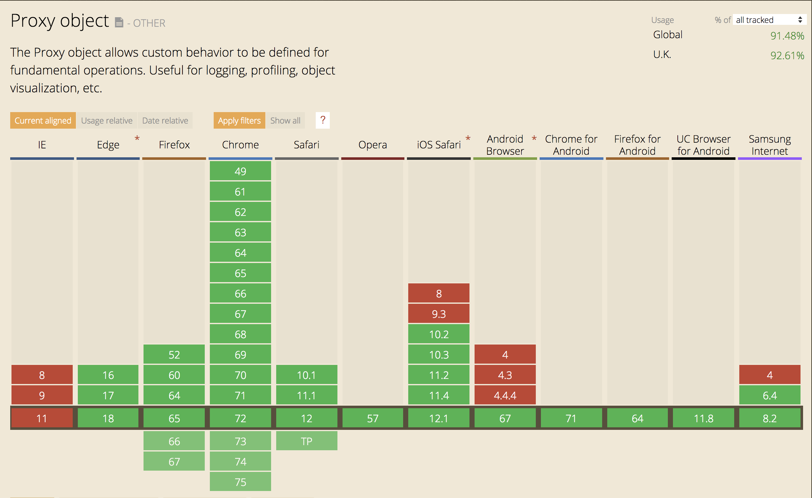
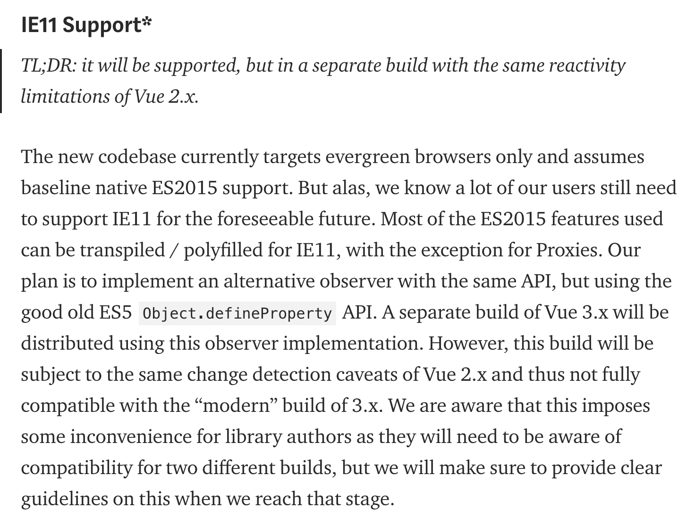
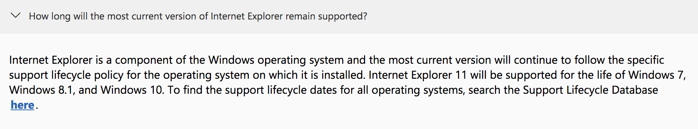
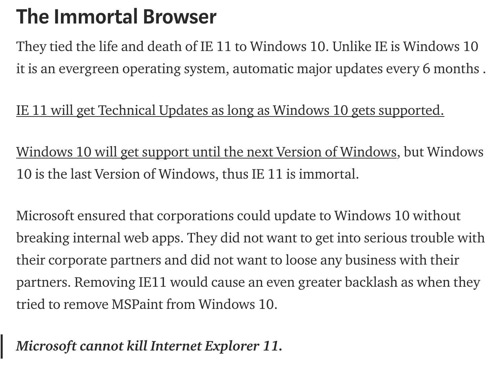

# Where does Vue 3 fit in with all this?

<!--- hide: 2 --->

(source: [Evan You](https://medium.com/the-vue-point/plans-for-the-next-iteration-of-vue-js-777ffea6fabf))

<!--- hide: 3 --->

(source: [caniuse](https://caniuse.com/#feat=proxy), browsers with > 0.1% global traffic)

<!--- hide: 4 --->

(source: [Evan You](https://medium.com/the-vue-point/plans-for-the-next-iteration-of-vue-js-777ffea6fabf))

<!--- hide: 5 --->

(source: [Microsoft](https://www.microsoft.com/en-us/windowsforbusiness/end-of-ie-support))

<!--- hide: 6 --->

(source: [Medium](https://medium.com/@burger.neal/the-end-of-life-of-internet-explorer-11-12736f9ff75f))